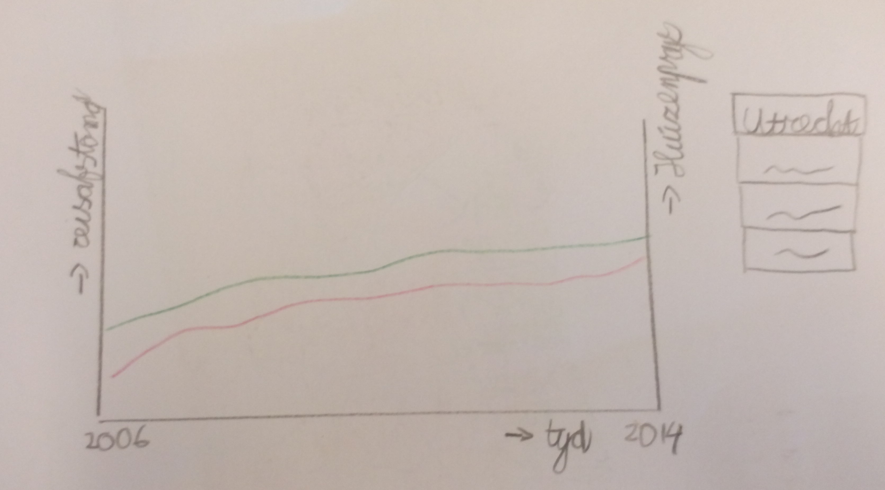

#Design document

### Webpagina
Het design van de webpagina is gebaseerd op [dit artikel](http://www.nytimes.com/interactive/2015/05/03/upshot/the-best-and-worst-places-to-grow-up-how-your-area-compares.html?&contentId=&mediaId=&referrer=http%3A%2F%2Fwww.nytimes.com%2Fpages%2Fmultimedia%2Findex.html%3Fmodule%3DSiteIndex%26region%3DFooter%26pgtype%3Dsectionfront&priority=true&action=click&contentCollection=U.S.&region=Footer&module=WhatsNext&version=WhatsNext&contentID=WhatsNext&moduleDetail=undefined&pgtype=Multimedia)
van de New York Times. De pagina start dus met een titel en ondertitel. Vervolgens volgt de hoofdvisualisatie. Hierna komt een stuk tekst over de hoofdvisualisatie en deelvisualisatie 1. Dan komt deelvisualisatie 1 zelf. Dan weer een blok tekst. Dan komt deelvisualisatie 2, etc. 

###Hoofdvisualisatie

In deze visualisatie kan de gebruiker zelf kijken waar de mensen vandaan komen die in zijn woonplaats werken en waar inwoners van zijn woonplaats gaan werken. 

######Dataset
De dataset bevat informatie per gemeente over het aantal mensen dat daar werkt en het aantal mensen dat daar woont. Deze informatie is uitgesplitst per gemeente zodat je kan zien uit welke woongemeentes de mensen komen die in een andere gemeente werken. In deze dataset zijn inwoners van Nederland die in het buitenland werken en inwoners van een ander land die in Nederland werken niet meegenomen. Dit is ten eerste gedaan omdat de data niet beschikbaar is, daarnaast houdt het de kaart ook beperkt en overzichtelijk. 

######Opbouw databestand voor visualisatie
Het databestand zal omgezet worden in een json file. Dit json file heeft drie properties  de plaats, het aantal mensen dat per plaats naar “de plaats” reist en  aantal mensen dat per plaats van “de plaats” weg  reist. Deze laatse twee properties is een array van objects, die allemaal een plaatsnaam en het aantal mensen bevat. 
Voor ieder jaar wordt een nieuw databestand geladen. Een voorbeeldstukje json:

######Laden van de kaart
De kaart wordt gemaakt met behulp van svg files van Nederland. Het nadeel van Nederland is dat ieder jaar de gemeentegrenzen van minstens één gemeente wijzigt. Ik zal toch ieder jaar de gemeente indeling van 2014 gebruiken om een vergelijking tussen jaren mogelijk te maken. Alle gevonden data gebruikt ook de gemeente indeling van 2014. 

######Koppeling tussen twee kaarten
Wanneer er op een plaats geklikt wordt in één van de kaarten licht deze plaats in beide kaarten op. Er komt dus een onclick functie die werkt op beide kaarten. Als een plaats wordt geselecteerd wordt dus zowel de data van het aantal mensen dat per plaats naar “de plaats” reist en  aantal mensen dat per plaats van “de plaats” weg  reist gebruikt. 

Voor klikken op plaats Rotterdam:

Na klikken op plaats Rotterdam:

###Deelvisualisatie 1: Huizenprijzen grote steden
Deze visualisatie laat zien of er een verband is tussen de stijging van de huizenprijzen in een stad en de afstand die mensen afleggen om in een stad te kunnen werken. Deze visualisatie is een linegraph met twee assen (afbeeldingnaam).

######Dataset
De dataset bevat de gemiddelde verkoopprijs van een huis per jaar en de gemiddelde afstand die naar één van de grote steden wordt afgelegd. 

######Opbouw databestand voor visualisatie
De data komt in een json-file, waarbij iedere plaats een object is met de properties plaatsnaam, gemiddelde verkoopprijs en gemiddelde afstand. De laatste twee zijn dan weer array’s van object met het jaartal en de data. 
Keuzemogelijkheden
De gebruiker kan met een dropdown kiezen over hij de gemiddeldes over de vier grote steden wil zien, of dat hij de data per stad wil zien. 

Deelvisualisatie 1 van Utrecht:

 
###Deelvisualisatie 2: De verste reizigers
In deze visualisatie kan de lezer zien wat de gemeentes zijn van waaruit de mensen het verst moeten reizen naar hun werk en waar zij naartoe gaan. Deze visualisatie bestaat uit een barchart en een kaart. 

######Dataset
De dataset bevat de gemiddelde afstand die inwoners van een gemeente moeten afleggen naar hun werk en naar welke plaatsen deze mensen reizen. 

######Opbouw databestand voor visualisatie
Het json object per plaats bevat de volgende properties: plaatsnaam, gemiddelde reisafstand en de plaatsen waarnaartoe gereisd wordt. 
Werking visualisatie
De gebruiker ziet in eerste instantie een barchart van de tien gemeentes van waaruit mensen het verst moeten reizen. Wanneer men op één van de barchart klikt ziet met een versie van de “van” kaart uit de hoofdvisualisatie, die is ingekleurd voor de plaats die in de barchart is aangeklikt. Hierdoor ziet men waar de verste reizigers naartoe moeten. 

Deelvisualisatie 2:

###Deelvisualisatie 3: Aantal werkenden per inwoner
Dit is een kaart dat laat zien wat per gemeente de balans is tussen het aantal mensen dat woont in een stad en het aantal inwoners van Nederland dat daar werkt. 

######Dataset
De dataset bevat per plaats het aantal werkenden per inwoner. Dus het aantal mensen dat in een stad werkt gedeeld door het totale inwoneraantal. 

######Opbouw databestand voor visualisatie
Het json object per plaats bevat de volgende properties: plaatsnaam en aantal werkenden per inwoner. 

######Werking visualisatie
De visualisatie wordt ingekleurd aan de hand van het aantal werkenden per inwoner, er komt ook een tooltip waarin je het precieze getal kan zien. Als een stad een waarde groter dan 1 heeft werken er meer mensen dan dat er wonen. 

Deelvisualisatie 3:

