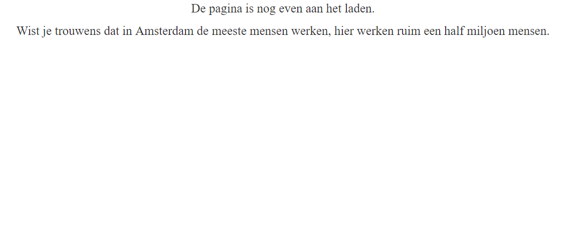
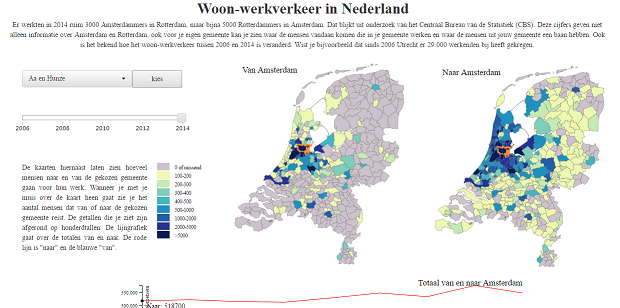
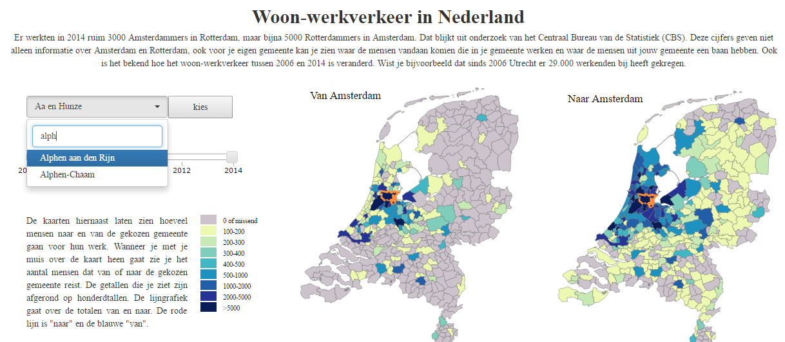
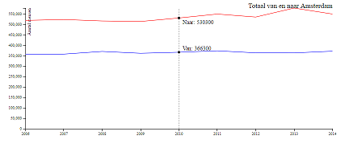
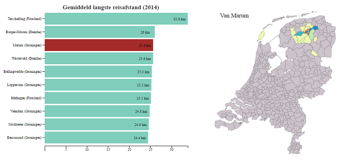
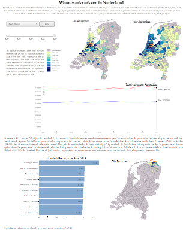

### Woon-werkverkeer in Nederland
##### Doel
Het doel van de visualisatie is de gebruiker inzicht geven in het woon-werkverkeer in Nederland en de ontwikkeling die dit vanaf 2006 heeft doorgemaakt. De gebruiker kan door de visualisate zelf de data makkelijk doorzoeken en patronen ontdekken. Daarnaast zijn er in de tekst en de tweede visualisatie een aantal interessante aspecten van de dataset uitgelicht. 

De visualisatie ziet er als volgt uit:

######Laadpagina:

######Beeld na de laadpagina:

######Werking dropdown:

######Lijngrafiek gekoppeld aan kaarten:

######Tweede visualisatie:

######Complete visualisatie uitgeprint:

####Bronnen: 
De d3 library en d3 tip
Jquery
Bootstrap en bootstrap-select

####Licentie:
Copyright (c) 2016 Shannon Bakker.

