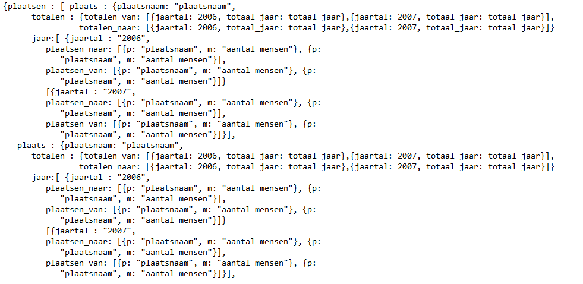

#Eindverslag
###Beschrijving datavisualisatie
De visualisatie gaat over het woon-werkverkeer in Nederland. De pagina bestaat uit twee visualisaties. De belangrijkste visualisatie, hier verder hoofdvisualisatie genoemd, staat bovenaan de pagina. Deze visualisatie bestaat uit twee kaarten en een lijngrafiek. De kaarten zijn ingekleurd op basis van het aantal mensen dat voor zijn werk van of naar een gekozen plaats reist. Wanneer de pagina wordt geladen is deze plaats standaard Amsterdam. Vervolgens kan men met een dropdown-menu of door te klikken op één van de kaarten een plaats selecteren. Ook kan het jaartal met behulp van een slider worden veranderd. Gekoppeld aan deze kaarten zit ook een lijngrafiek. Deze laat de ontwikkeling over tijd zien van het aantal mensen dat naar een gemeente gaat en het aantal mensen dat uit de gemeente vertrekt. 
Na de hoofdvisualisatie volgt een stukje tekst met interessante informatie uit de visualisatie. De tweede visualisatie staat hieronder en deze laat de top tien van gemeentes zien, waaruit gemiddeld het verst wordt gereisd. De visualisatie bestaat uit een liggende barchart en een kaart. Op de barchart zie je de gemeentes en de gemiddelde reisafstand, op de kaart zie je waar de mensen uit deze gemeente naartoe reizen.

Uitgezoomd ziet de visualisatie er als volgt uit:

###Visueel design
In de volgende paragraaf bespreek ik een aantal keuzes van mijn visueel design. 

#####Twee kaarten
In de hoofdvisualisatie is er een kaart ‘van’ en een kaart ‘naar’. Deze twee kaarten staan naast elkaar en zie je dus altijd tegelijk. Het was ook mogelijk geweest om een button te maken waarmee je één van de twee kaarten selecteert. Ik heb hier niet voor gekozen, omdat ik in mijn visualisatie de nadruk wilde leggen op het verschil tussen ‘van’ en ‘naar’. Zeker bij grotere steden is dit verschil duidelijk te zien. Dit was lastiger geweest wanneer de twee kaarten niet naast elkaar hadden gestaan.  

#####Kleurenschema kaart
Ik wilde een neutraal kleurenschema voor de kaart, aangezien meer of minder woon-werkverkeer niet per sé positief of negatief is. Het kleurenschema dat ik heb gekozen is geel/blauw. Dit schema is neutraal, de verschillen tussen plaatsen zijn duidelijk te zien en het schema ziet er aantrekkelijk uit. De geselecteerde plaatsen zijn oranje omlijnd. Er is voor oranje gekozen omdat deze kleur niet vloekt bij het kleurenschema, maar tegelijkertijd ook voldoende onderscheidend is. 

#####Verticale lijn in lijngrafiek
Wanneer je met de muis over de lijngrafiek van de hoofdvisualisatie gaat zie je de data van de plaats van de muis. Het datapunt wordt weergegeven door middel van een balletje en een stukje tekst. Het jaartal dat bij deze data hoort zie je door middel van een gestippelde lijn naar de x-as. Ik heb besloten om deze lijn toe te voegen, omdat het zonder lijn niet duidelijk is over welk jaar de data gaat. Het jaartal aan de tekst toevoegen was niet aantrekkelijk, aangezien er altijd twee tekstjes te zien zijn en er dan dus ook altijd twee keer hetzelfde jaartal te zien zou zijn.  

#####Liggende barchart
In de tweede hoofdvisualisatie zit een liggende barchart. Ik heb voor een liggende barchart en niet voor een staande barchart gekozen, omdat ik een top tien visualiseer. In een liggende barchart zie je heel snel de bovenste balk, en in de top tien is dit ook plaats één uit de top tien. Plaats één is het meest ineteressant in de barchart en daarom wilde ik ook dat deze als eerste te zien zou zijn. 

###Technisch design
De visualisatie staat in een html-pagina, een css-pagina, twee datasets in json en meerdere javascriptbestanden. 
De json-bestanden zijn:
-	data_hoofdvisalisatie.json: de data waarmee alle kaarten worden ingekleurd
-	afstanden.json: de data waarmee de barchart van visualisatie twee wordt gemaakt

De javascriptbestanden zijn: 
-	hoofdvisualisatie.js: hiermee wordt de data ingeladen, het dropdown menu, de tooltip en de slider functioneel gemaakt en worden de kaarten ingekleurd
-	lijngrafiek_hoofdvisualisatie.js: hiermee wordt de lijngrafiek gemaakt die aan de kaarten van de hoofdvisualisatie is gelinkt. 
-	fun_facts.js:  maakt de functionaliteit voor de laadpagina
-	afstand_visualisatie.js: hiermee wordt de tweede visualisatie gemaakt

#####De data inladen
In onderstaande afbeelding is de opbouw van data_hoofdvisualisatie.json te zien. Deze wordt gebruikt voor de hoofdvisualisatie en de kaart van visualisatie twee.

De dataset wordt in het javascript bestand hoofdvisualisatie.js ingeladen. De data van de totalen moeten om ze goed in de grafiek te plaatsen eerst worden bewerkt in javascript. Tijdens het inladen van de data wordt ook het dropdown menu gemaakt waarmee je een plaats kan kiezen. Dankzij bootstrap-select kan je ook zoeken in dit dropdown-menu.
 
De dataset is vrij groot, omdat voor iedere Nederlandse gemeente van alle 403 gemeentes ‘van’- en ‘naar’-data is. Zonder de totalen zijn er dus 403*(403+403)=324.818 datapunten.
Om deze reden duurt het een aantal seconden voordat de pagina is ingeladen. Om de gebruiker te laten weten dat er nog data komt, is er een laadpagina. Op deze laadpagina wordt een random feitje over woon-werkverkeer in Nederland getoond, dit feitje wordt gekozen met behulp van fun_facts.js. 

#####De kaart
De kaart is een svg met alle gemeenten in Nederland in 2014. De naam van de gemeente is het id. Spaties en andere vreemde tekens zijn uit de plaatsnamen verwijderd. 

#####De kaarten inkleuren
Wanneer de data is ingeladen wordt met de functie colour_map in hoofdvisualisatie.js de kaart ingekleurd en worden de muisfuncties toegevoegd. Aan de functie colour_map wordt meegegeven welke kaart moet worden ingekleurd en voor welke plaats de kaart moet worden ingekleurd. De plaats wordt doorgegeven als een nummer. De plaatsen hebben dit nummer op alfabetische volgorde gekregen. Waarbij de eerste plaats,  Aa en Hunze, nul heeft gekregen. De cijfers van de plaatsen corresponderen met de volgorde waarmee ze in de dataset staan. Hierdoor is het mogelijk om snel het juiste item te vinden in de array van plaatsen.  

In de functie colour_map wordt eerst de juiste kaart geselecteerd, de titel van de kaart toegevoegd en de geselecteerde plaats oranje gearceerd. Vervolgens wordt er een loop gemaakt door de ‘plaatsen_van’- of ‘plaatsen-naar’-data. Op basis van deze data wordt de kaart gekleurd, met een globaal gedefinieerd kleurschema. Tot slot worden de muisfuncties bijgevoegd. Hier wordt ook de functie add_mouseover in hoofdvisualisatie.js aangeroepen. Deze zorgt ervoor dat de tooltip de correcte tekst bevat. De ‘on click’ functie zorgt ervoor dat de kaart opnieuw wordt ingekleurd wanneer er op een andere plaats wordt geklikt. Dit wordt gedaan door de functie colour_map opnieuw aan te roepen. 

##### De lijngrafiek
De lijngrafiek wordt gemaakt met de functie make_linegraph uit lijngrafiek_hoofdvisualisatie.js. Deze functie wordt meestal tegelijk aangeroepen met de colour_map functie. Alleen bij de slider en de tweede visualisatie gebeurt dit niet. In de make_linegraph functie wordt, wanneer er een oude lijngrafiek is deze verwijdert en worden er twee paths gemaakt voor de datalijnen. Aan deze lijnen worden er ook twee dots en een lijn toegevoegd die meebewegen wanneer de muis over de lijngrafiek gaat. Ook de x- en y-as worden uiteraard gemaakt. 

##### Tweede visualisatie
De tweede visualisatie wordt gemaakt met de functie visualisation_distance in afstand_visualisatie.js. Deze functie wordt maar één keer aangeroepen, namelijk in hoofdvisualisatie.js als de data geladen is. Wanneer de functie is aangeroepen wordt eerst met behulp van colour_map de kaart svg_afstand gekleurd voor de plaats bovenaan de barchart, namelijk Terschelling. Vervolgens worden er verschillende parameters voor de barchart goedgezet en de data voor de barchart ingeladen. De data komt uit afstanden.json. Hierna worden de assen en de bars gemaakt. Wanneer de gebruiker met de muis over een bar gaat wordt de kaart svg_afstand met colour_map gekleurd voor de plaats die bij de bar hoort. 

###Uitdagingen
#####Minder visualisaties
In het design document had ik het plan om vier losse visualisaties te maken. Dit bleek te ambitieus voor vier weken, om deze reden zijn deelvisualisatie 1 en 3 uit het design document niet uitgevoerd. Ik heb gekozen voor deelvisualisatie 2, omdat uit de standups bleek dat men deze het meest interessant vond. Ook ikzelf vond dit het beste idee van de drie deelvisualisaties. 

#####Selecteer een plaats
Qua visueel design is verder alleen de zoekbalk veranderd. In plaats van een zoekbalk waar je exact de juiste plaatsnaam moet intypen is gekozen voor een dropdown menu, waar je ook in kan zoeken. Dit is gemakkelijker voor de gebruiker en minder foutgevoelig. Met dit dropdown menu was er nog wel het probleem dat de geselecteerde plaats in de dropdown niet wijzigt wanneer er op de kaart wordt geklikt. De enige oplossing hiervoor was het totaal verwijderen van de dropdown en hem opnieuw aanmaken. Dit maakte het programma trager en het loste geen erg groot probleem op. Om deze reden heb ik dit niet zo gedaan. 
Er is om deze reden wel een kiesbutton met een on-click functie gemaakt. Wanneer je alleen een onchange op de dropdown hebt en de kaart verandert doordat erop is geklikt kan je niet naar de geselecteerde plaats in de dropdown terug zonder eerst op een andere plaats te klikken. De kiesbutton lost dit op. 

##### Plaatsnamen als id
Een ander probleem was dat een id geen spatie mag hebben en veel plaatsnamen hebben wel spaties. Dit is voor de svg met de hand opgelost. De plaatsnamen in de dataset  moesten wel corresponderen met de id’s. Om deze reden zijn de plaatsnamen in de functie colour_map ontdaan van hun spaties. Andere rare tekens zijn zowel in de svg als de dataset met de hand verwijdert. 

##### Dataset is groot
Een volgend probleem is de grote van de dataset. Hoewel de dataset nog steeds 90 mb is heb ik hem wel 40 mb kleiner kunnen maken dankzij het gebruik van kortere key’s. De key's zijn helaas wel minder duidelijk dan de originele namen. Toch vond ik in dit geval de behaalde tijdswinst bij het inladen van de pagina groot genoeg om dit te accepteren. Zou ik nog eens vier weken hebben voor dit project, dan zou ik gebruik maken van een online database, zoals MySQL. 

##### Globale variabelen
De functies in hoofdvisualisatie.js namen in eerste instantie veel meer variabelen mee. Omdat steeds dezelfde variabelen werden meegegeven en omdat het soms erg ingewikkeld werd om de juiste variabele mee te gegeven is besloten een aantal globale variabelen toe te voegen. Dit zijn data, year, place en alle previous-waarden. Ondanks dat place en year globale variabele zijn, worden deze toch meegegeven aan de colour_map functie, dit omdat bij de tweede visualisatie, die niet gelinkt is aan de hoofdvisualisatie ook gebruik gemaakt wordt van de colour_map functie. 

##### Missende data
Er is relatief veel data dat mist. Ik heb hier het CBS over gemaild en de voornaamste reden voor de missende data is de anonimisering van de gegevens. Om deze reden is alle data ook op honderdtallen afgerond. Een andere belangrijke reden is gemeentelijke herindelingen. Ik gebruik data die de gemeentes van 2014 hanteert, dit betekent dat als een gemeente een andere indeling had in een jaar voor 2014, de data voor dat jaar mist. In eerste instantie had ik ervoor gekozen om de missende data en de datapunten met een waarde nul een verschillende kleur te geven in de kaarten. Dit zorgde voor chaotische kaarten en bovendien dachten veel gebruikers dat op de plaatsen met de waarde nul, de waarde groter was dan nul. Om deze reden hebben gemeentes met nul als waarde of missende data beide een grijze kleur. 

##### Rozendaal klopt niet
Dankzij de visualisatie heb ik een fout ontdekt in de oorspronkelijke data. Volgens het CBS reisden er in 2007 5300 mensen vanuit Rozendaal naar een andere gemeente voor werk. Het probleem is dat Rozendaal slechts 1500 inwoners heeft, waardoor de data nooit kan kloppen. Ik heb besloten deze fout toch te behouden, aangezien ik de data van het CBS visualiseer en ik er niet achter kan komen wat de juiste data van dat jaar was. Ik verwijs in mijn visualisatie ook naar de brontabel. 

###Tot slot
Wanneer ik het project overnieuw zou doen, zou ik als eerste de data op een andere manier inladen. Een laadscherm gedurende enkele seconde probeer ik dan te voorkomen. Daarnaast zou ik meer tijd nemen om de data zelf goed te analyseren en patronen te zoeken in de data. Met de resultaten van deze analyse zou ik extra visualisaties maken die meer inzicht geven in het woon-werkverkeer in Nederland. 

